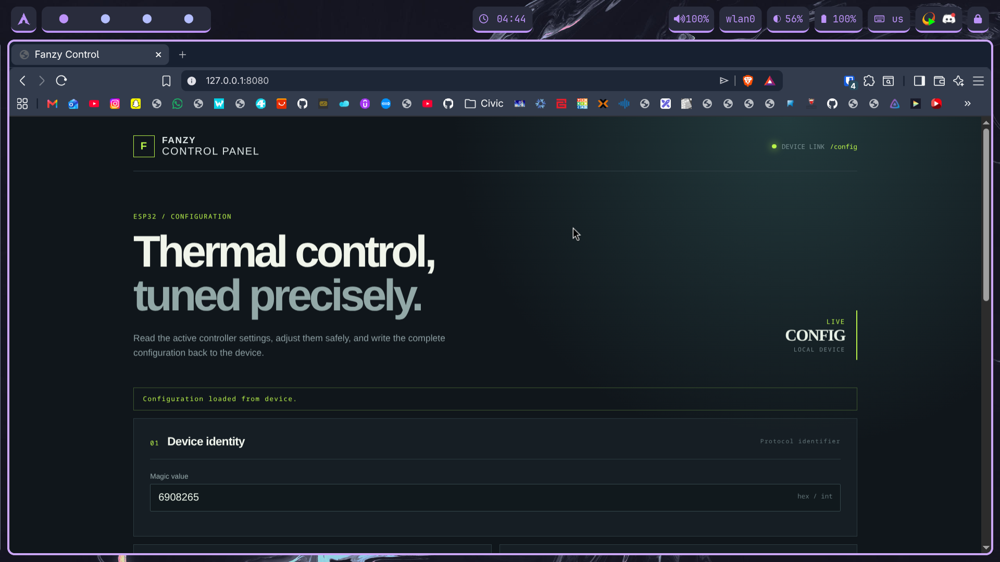

# fanzy-prog

This project configures the [fanzy](https://github.com/qulxizer/fanzy) project
using an ESP32 UART half-duplex connection. It provides an HTTP server and a
web interface for reading and writing the fan controller configuration.

Join the ESP32 Wi-Fi access point and open:

```text
http://192.168.4.1/
```

The web interface reads the current configuration from the device and can send
updated settings back over UART.



